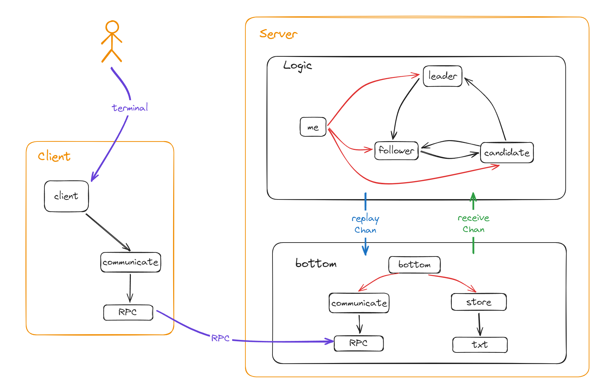

## 高可用分布式日志数据库

​																													by YipingWang

### 一、设计要求

##### 要点一

​	基于Raft算法设计，使用Go语言开发，设计为日志数据库。

##### 要点二

​	第O版本只提供数据的插入功能。

##### 要点三

​	原神、启动！


### 二、Raft算法逻辑

#### leader：

	1.leader收到一个term大于自己的请求：
			立即退化成follower，之后按照follower处理。
	
	2.leader收到一个term小于自己的请求：
		2.1.如果是一个Committing、Committed、Heartbeat请求：
			可能是某个脑裂的Leader刚刚回归，或者是一个以前的数据。对于这种数据，Leader的统一回复一个Heartbeat(term)。如果是一个脑裂节点，那么它会发现任期号大于自己，立即变成follower。
		2.2.如果是一个Vote请求：
			返回一个拒绝投票的请求VoteRecv(disagree)。【回复一个Heartbeat也可以，只需要表明自己的任期较高就行】
		2.3.其他不予处理。
	
	3.leader收到一个同任期的请求：
		3.1.如果是一个Committing、Committed、Heartbeat请求：
			报错，不可能存在两个leader。
		3.2.如果是一个Vote请求：
			返回一个拒绝投票的请求VoteRecv(disagree)。
		3.3.如果是一个CommittingRecv请求：
			3.3.1.如果agree，说明此时有一个follower在本任期内完成一笔数据的提交。如果leader找得到这个消息，同时还有需要同步的数据，继续发送Committing请求给这个follower。如果找不到，发送一个最新日志的Committing。
			3.3.2.如果这份请求日志还是自己还未committed的数据，同时这份数据是leader在本term中Committing的，那么将follower提交日志数+1，如果提交数超过一半，leader自己提交该数据，并给所有节点发送Committed(LastLogKey)的请求提交这份日志。
			3.3.3.如果disagree，说明日志被拒绝。如果leader找到了这条日志，则尝试发送上一条日志Committing(SecondLastLogKey, SecondSecondLastLogKey)。如果leader找不到这条日志，发送自己的LastCommitting的日志的Committing请求（可能是一个错乱的请求，需要leader纠正）。【这里简化，leader直接追加整个日志，找到了将从follower的LastLogKey到自己最新一期的Commiitting日志发送过去，找不到说明日志错乱，发送自己的Committing第一条】
		3.4.如果是一个WriteLog请求：
			说明是客户端请求写入日志，此时leader会将日志追加到自己的预写日志中（Committing日志）之后对全体节点广播Committing(LastLogKey, SecondLastLogKey)请求。
		3.5.其他不予处理。


#### follower:

	1.follower收到一个大于自己term的请求：
			将自己的term修改至一样，投票清零，跳转至3。
	
	2.follower收到一个小于自己term的请求：
		2.1.如果是一个Vote请求：
			返回一个拒绝投票的请求VoteRecv(false， term)。
		2.2.其他不予处理。
	
	3.follower收到一个等于自己term的请求：
		3.1.如果是Heartbeat请求：
			重置自己的定时器。
		3.2.如果是Committing请求：
			说明是leader递送的一笔请求。
			3.2.1.如果Committing的SecondLastLogKey和自己日志的LastLogKey一致的话，返回CommittingRecv(agree, term, LastLogKey)，将日志写入预写日志（Committing日志）。
			3.2.2.如果不一致，依次取消自己的Log直到LastLogKey小于等于Committing的SecondLastLogKey，如果等于，返回CommittingRecv(agree, LastLogKey)，将日志写入预写日志（Committing日志）；否则，返回CommittingRecv(disagree, SecondLastLogKey, MyLastLogKey)。
		3.3.如果是Committed请求：
			遍历自己的日志，如果有日志的LogKey与请求一致，将这个包括这个日志之前的所有日志都置为Committed。
		3.4.如果是Vote请求：
			3.4.1.如果投票位已经置为true了，VoteRecv(disagree)拒绝投票。
			3.4.2.如果投票位为false，如果Vote中的LastLogKey小于自己，Vote(disagree)拒绝投票。
			3.4.3.否则投票并将自己的投票位设置为true，赞成。
		3.5.其他不予处理。
	
	4.计时器到期后转换成candidate。


#### candidate:	

	1.candidate收到一个大于自己term的请求：
			立即退化成follower，之后按照follower的逻辑处理。
			
	2.candidate收到一个小于自己term的请求：
		不予处理。
	
	3.candidate收到一个等于自己term的请求：
		3.1.如果是一条Committing、Committed、Heartbeat请求：
			立即退化成follower，之后按照follower逻辑处理。
		3.2.如果是一条Vote请求：
			投反对票。
		3.3.如果是一条VoteRecv请求：
			说明是本轮的竞选返回结果。
			进行标记agree和disagree的数量，如果同意数大于一半，该节点晋升为leader，如果反对数大于一半，该节点下降为follower。
	
	4.转换成candidate后term+1，随机一段时间后开始广播Vote。（首先进行PreVote，PreVote中有一个特殊的刚刚设定的编号保证自己是本次的PreVote，所有节点收到这个PreVote后都会返回自己的term和原先带的那个编号PreVoteRecv，只有在此期间candidate没有收到term比自己大的并且收到了一半以上的PreVoteRecv，才证明自己和多数节点还是保留相连的，此时才会发起选举，此过程防止term号无限的被拉长）
	
	5.计时器到期后仍然没有多余一半的节点同意自己也没有多余一半的节点反对自己，首先怀疑自己的是否发生脑裂，发送一次PreVote请求，查看响应节点的数量，如果小于一半，一直尝试，如果多于一半，那么自己的term+1，随机一段时间后再次广播Vote。PreVote为证明信号，节点收到后返回即可，不用携带任期号，但是有一个全局唯一的Key标识。


### 三、系统架构




​	系统采用CS架构。其中服务节点分为两部分，Logic和bottom，Raft算法被抽象为Logic，通过管道与bottom相连保证系统的低耦合，可以变更bottom的配置适应于不同的应用场景，bottom又封装两个功能模块，通讯模块communicate和存储模块store，分别负责节点与节点、节点与客户端的通讯和日志的存储。客户端提供终端接入的方式，客户调用终端命令完成对日志的存储操作。

​	现阶段bottom中的两个模块分别使用RPC和普通文件txt实现，节点之间、节点与客户端之间也通过RPC完成数据的同步操作。


### 四、部署与运行


服务节点部署：

db.conf文件示例：

```json
{
"id":0,
"num":5,
"term":0,
"ckt":-1,
"cki":-1,
"dns":["localhost:18000","localhost:18001","localhost:18002","localhost:18003","localhost:18004"],
"leaderHeartbeat":10,
"followerTimeout":20,
"candidatePreVoteTimeout":30,
"candidateVoteTimeout":30,
}
```

```json
{
"id":0, // 本节点ID
"num":5, // 当前节点数量
"term":0, // 本节点当前任期（不要设置）
"ckt":-1, // 已提交最高日志任期
"cki":-1, // 已提交最高日志编号
"dns":["localhost:18000","localhost:18001","localhost:18002","localhost:18003","localhost:18004"], // 所有节点地址
"leaderHeartbeat":10, // leader心跳间隔
"followerTimeout":20, // follower超时时间
"candidatePreVoteTimeout":30, // 预选举超时时间
"candidateVoteTimeout":30, // 选举超时基础时间
}
```


运行方式：

```
> cd ./RaftDB_v0.1
> go build main.go
> main [conf文件位置] [日志文件保存位置]
```


客户端使用

```json
> cd ./RaftDB_client
> go build main.go
> main [leader的IP和端口，例如 localhost:18000] [日志信息，例如 hello]
```


### 五、缺陷


1.客户端必须知道leader位置，发送命令给follower follower不会接受

2.log的并发问题，只做了基本控制

3.并发压力，现阶段没有测试

4.可行性：现阶段没有测试，只可以完成简单的处理

5.终端输出运行日志缺乏管理与分级

6.不支持动态扩缩容


### 六、未来改进


1.增加自动寻主

2.增加日志级别

3.增加并发安全

4.集中测试

​	
